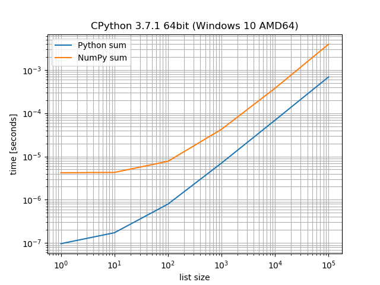
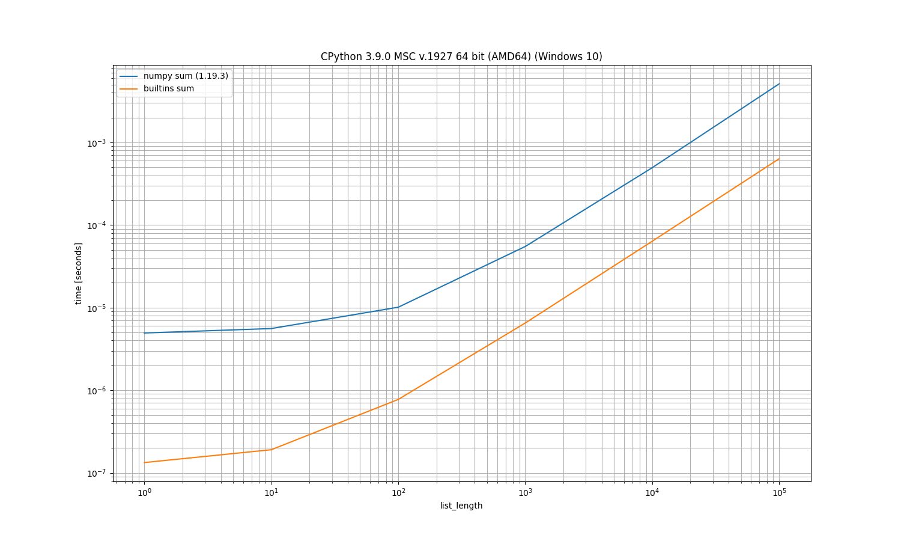

simple_benchmark
================

A simple benchmarking package including visualization facilities.

The goal of this package is to provide a simple way to compare the performance
of different approaches for different inputs and to visualize the result.

Documentation
-------------

.. image:: https://readthedocs.org/projects/simple-benchmark/badge/?version=stable
   :target: http://simple-benchmark.readthedocs.io/en/stable/?badge=stable
   :alt: Documentation Status

Downloads
---------

.. image:: https://img.shields.io/pypi/v/simple_benchmark.svg
   :target: https://pypi.python.org/pypi/simple_benchmark
   :alt: PyPI Project

.. image:: https://img.shields.io/github/release/MSeifert04/simple_benchmark.svg
   :target: https://github.com/MSeifert04/simple_benchmark/releases
   :alt: GitHub Project

Installation
------------

Using ``pip``:

.. code::

   python -m pip install simple_benchmark

Or installing the most recent version directly from ``git``:

.. code::

   python -m pip install git+https://github.com/MSeifert04/simple_benchmark.git

To utilize the all features of the library (for example visualization) you need to
install the optional dependencies:

- `NumPy <http://www.numpy.org/>`_
- `pandas <https://pandas.pydata.org/>`_
- `matplotlib <https://matplotlib.org/>`_

Or install them automatically using:

.. code::

   python -m pip install simple_benchmark[optional]

Getting started
---------------

Suppose you want to compare how NumPys sum and Pythons sum perform on lists
of different sizes::

    >>> from simple_benchmark import benchmark
    >>> import numpy as np
    >>> funcs = [sum, np.sum]
    >>> arguments = {i: [1]*i for i in [1, 10, 100, 1000, 10000, 100000]}
    >>> argument_name = 'list size'
    >>> aliases = {sum: 'Python sum', np.sum: 'NumPy sum'}
    >>> b = benchmark(funcs, arguments, argument_name, function_aliases=aliases)

The result can be visualized with ``pandas`` (needs to be installed)::

    >>> b
              Python sum  NumPy sum
    1       9.640884e-08   0.000004
    10      1.726930e-07   0.000004
    100     7.935484e-07   0.000008
    1000    7.040000e-06   0.000042
    10000   6.910000e-05   0.000378
    100000  6.899000e-04   0.003941

Or with ``matplotlib`` (has to be installed too)::

    >>> b.plot()

To save the plotted benchmark as PNG file::

    >>> import matplotlib.pyplot as plt
    >>> plt.savefig('sum_example.png')

Command-Line interface
----------------------

.. warning::
   The command line interface is highly experimental. It's very likely to
   change its API.

It's an experiment to run it as command-line tool, especially useful if you
want to run it on multiple files and don't want the boilerplate.

File ``sum.py``::

   import numpy as np

   def bench_sum(l, func=sum):  # <-- function name needs to start with "bench_"
      return func(l)

   def bench_numpy_sum(l, func=np.sum):  # <-- using func parameter with the actual function helps
      return np.sum(l)

   def args_list_length():  # <-- function providing the argument starts with "args_"
      for i in [1, 10, 100, 1000, 10000, 100000]:
         yield i, [1] * i

Then run::

    $ python -m simple_benchmark sum.py sum.png

With a similar result:

Similar packages
----------------

- `perfplot <https://github.com/nschloe/perfplot>`_ by Nico Schlömer.
