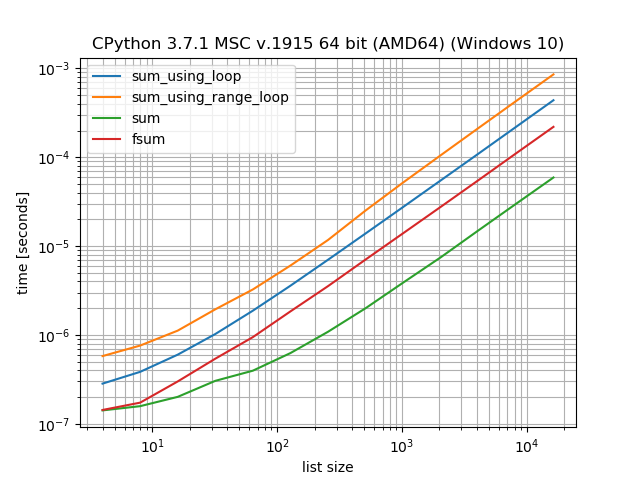
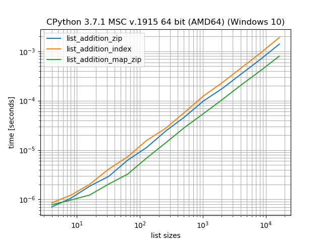

Extended examples
=================

BenchmarkBuilder
----------------

The :class:`simple_benchmark.BenchmarkBuilder` class can be used to build a benchmark using decorators, essentially
it is just a wrapper around :func:`simple_benchmark.benchmark`.

For example to compare different approaches to calculate the sum of a list of floats::

    from simple_benchmark import BenchmarkBuilder
    import math

    bench = BenchmarkBuilder()

    @bench.add_function()
    def sum_using_loop(lst):
        sum_ = 0
        for item in lst:
            sum_ += item
        return sum_

    @bench.add_function()
    def sum_using_range_loop(lst):
        sum_ = 0
        for idx in range(len(lst)):
            sum_ += lst[idx]
        return sum_

    bench.use_random_lists_as_arguments(sizes=[2**i for i in range(2, 15)])

    bench.add_functions([sum, math.fsum])

    b = bench.run()
    b.plot()
    # To save the plotted benchmark as PNG file.
    import matplotlib.pyplot as plt
    plt.savefig('sum_list_example.png')

MultiArgument
-------------

The :py:class:`simple_benchmark.MultiArgument` class can be used to provide multiple arguments to the
functions that should be benchmarked::

    from itertools import starmap
    from operator import add
    from random import random

    from simple_benchmark import BenchmarkBuilder, MultiArgument

    bench = BenchmarkBuilder()

    @bench.add_function()
    def list_addition_zip(list1, list2):
        res = []
        for item1, item2 in zip(list1, list2):
            res.append(item1 + item2)
        return res

    @bench.add_function()
    def list_addition_index(list1, list2):
        res = []
        for idx in range(len(list1)):
            res.append(list1[idx] + list2[idx])
        return res

    @bench.add_function()
    def list_addition_map_zip(list1, list2):
        return list(starmap(add, zip(list1, list2)))

    @bench.add_arguments(name='list sizes')
    def benchmark_arguments():
        for size_exponent in range(2, 15):
            size = 2**size_exponent
            arguments = MultiArgument([
                [random() for _ in range(size)],
                [random() for _ in range(size)]])
            yield size, arguments

    b = bench.run()
    b.plot()
    # To save the plotted benchmark as PNG file.
    import matplotlib.pyplot as plt
    plt.savefig('list_add_example.png')

Asserting correctness
---------------------

Besides comparing the timings it's also important to assert that the approaches actually
produce the same outcomes and don't modify the input arguments.

To compare the results there is :py:func:`simple_benchmark.assert_same_results`
(or in case you use BenchmarkBuilder :py:meth:`simple_benchmark.BenchmarkBuilder.assert_same_results`)::

    import operator
    import random
    from simple_benchmark import assert_same_results

    funcs = [min, max]  # will produce different results
    arguments = {2**i: [random.random() for _ in range(2**i)] for i in range(2, 10)}
    assert_same_results(funcs, arguments, equality_func=operator.eq)

And to compare that the inputs were not modified :py:func:`simple_benchmark.assert_not_mutating_input`
(or in case you use BenchmarkBuilder :py:meth:`simple_benchmark.BenchmarkBuilder.assert_not_mutating_input`)::

    import operator
    import random
    from simple_benchmark import assert_not_mutating_input

    def sort(l):
        l.sort()  # modifies the input
        return l

    funcs = [sorted, sort]
    arguments = {2**i: [random.random() for _ in range(2**i)] for i in range(2, 10)}
    assert_not_mutating_input(funcs, arguments, equality_func=operator.eq)

Both will produce an :py:class:`AssertionError` if they gave different results or mutate the input arguments.

Typically the ``equality_func`` will be one of these:

- :py:func:`operator.eq` will work for most Python objects.
- :py:func:`math.isclose` will work for :py:class:`float` that may be close but not equal.
- ``numpy.array_equal`` will work for element-wise comparison of NumPy arrays.
- ``numpy.allclose`` will work for element-wise comparison of NumPy arrays containing floats that may be close but not equal.

The :py:func:`simple_benchmark.assert_not_mutating_input` also accepts an optional argument that needs to be used in case
the argument is not trivially copyable. It expects a function that takes the argument as input and should
return a deep-copy of the argument.

Examples on StackOverflow
-------------------------

In some cases it's probably best to see how it can be used on some real-life problems:

- `Count the number of non zero values in a numpy array in Numba <https://stackoverflow.com/a/54832290/5393381>`_
- `When numba is effective? <https://stackoverflow.com/a/55442354/5393381>`_
- `Range with repeated consecutive numbers <https://stackoverflow.com/a/51115270/5393381>`_
- `Concatenate tuples using sum() <https://stackoverflow.com/a/54380236/5393381>`_
- `How to retrieve an element from a set without removing it? <https://stackoverflow.com/a/48874729/5393381>`_
- `What exactly is the optimization "functools.partial" is making? <https://stackoverflow.com/a/49966781/5393381>`_
- `Nested lambda statements when sorting lists <https://stackoverflow.com/a/51217757/5393381>`_
- `How to make a flat list out of list of lists? <https://stackoverflow.com/a/40813764/5393381>`_
- `How do you remove duplicates from a list whilst preserving order? <https://stackoverflow.com/a/41577279/5393381>`_
- `Iterating over every two elements in a list <https://stackoverflow.com/a/49742187/5393381>`_
- `Cython - efficiently filtering a typed memoryview <https://stackoverflow.com/a/51467813/5393381>`_
- `Python's sum vs. NumPy's numpy.sum <https://stackoverflow.com/a/49908528/5393381>`_
- `Finding longest run in a list <https://stackoverflow.com/a/49955110/5393381>`_
- `Remove duplicate dict in list in Python <https://stackoverflow.com/a/51389105/5393381>`_
- `How do I find the duplicates in a list and create another list with them? <https://stackoverflow.com/a/41817537/5393381>`_
- `Suppress key addition in collections.defaultdict <https://stackoverflow.com/a/49824929/5393381>`_
- `Numpy first occurrence of value greater than existing value <https://stackoverflow.com/a/49927020/5393381>`_
- `Count the number of times an item occurs in a sequence using recursion Python <https://stackoverflow.com/a/35895862/5393381>`_
- `Converting a series of ints to strings - Why is apply much faster than astype? <https://stackoverflow.com/a/49804868/5393381>`_

See also `Results for "simple_benchmark" on StackOverflow <https://stackoverflow.com/search?q=simple_benchmark+%5Bpython%5D>`_.
